# Arquitetura de Software - Microserviços

## Projeto Base

O projeto utilizado como base foi o da primeria iteração, no qual desenvolvemos uma solução monólitica, onde tivemos de
aplicar os princípios SOLID e design paterns, como o _adapter pattern_. Nessa mesma solução era necessário permitir a
escolher diferentes bases de dados, como mongodb,neo4j e h2. Para além disso tinhamos de dar especial atenção à
configuração, ou seja a solução tinha de ser configurável, de forma a que fosse possível alterar a base de dados
utilizada, bem como alterar diferentes algoritmos para criar sku's e recomendações.

Nesta segunda iteração, temos como objetivo desenvolver uma solução baseada em microserviços, onde cada microserviço
tem uma responsabilidade única, e comunica com os outros microserviços através de um message broker, para o
desenvolvimento desta solução utilizamos diferentes padrões, comumente utilizados em arquiteturas orientadas a
microserviços.

## Problemas existentes e possíveis soluções

A solução monolítica inicial apresenta desafios que podem prejudicar a eficiência e a eficácia do sistema. Um desses
desafios são os problemas de desempenho. À medida que o número de pedidos aumenta, a arquitetura monolítica tem 
dificuldade em ser dimensionada, o que pode resultar em tempos de resposta mais longos e taxas de erro mais elevadas,
afectando negativamente a experiência do utilizador. A incapacidade do sistema para lidar eficazmente com pedidos simultâneos
dos utilizadores é um inconveniente significativo que pode resultar numa perda de fiabilidade e disponibilidade do serviço.

A solução atual não utiliza os recursos de hardware de forma eficiente, o que leva ao desperdício de recursos e a 
'bottlenecks''. A ineficiência pode ser dispendiosa, tanto em termos de despesas operacionais como da potencial
necessidade de actualizações não planeadas de hardware para satisfazer a procura.

O processo de 'release' de novas versões do software não é nem rápido nem eficiente, o que coloca desafios à sua 
exequibilidade. Isto pode atrasar a implementação de novas funcionalidades e correcções de erros, prejudicando a
capacidade do sistema para se adaptar a requisitos em mudança ou para resolver prontamente problemas críticos. 
Num mercado em rápida mutação, a incapacidade de lançar actualizações de forma eficiente pode prejudicar
significativamente uma empresa, tornando-a menos recetiva às necessidades dos seus utilizadores.

Estes desafios são inerentes às arquitecturas monolíticas e podem ter impactos de grande alcance na capacidade da 
empresa para crescer e manter um elevado nível de qualidade de serviço. A identificação destes problemas é o primeiro
passo para procurar estratégias que permitam ultrapassar as limitações do sistema atual.

Para tal, foram identificadas as seguintes soluções:

| Category                    | Solution 1                  | Solution 2                 | Solution 3                              | Selection |
|-----------------------------|-----------------------------|----------------------------|-----------------------------------------|-----------|
| Performance                 | Better Performance          | Better DBMS                | More Instances                          | 3+4       |
| Use Hardware Parsimoniously | Better Hardware when needed | More Instances when needed | Load Balancer                           | 2+3       |
| Releasibility               | Better Project Management   | Increase Resources         | Adopt Continuous Integration            | 4+3       |
| API Stability               | Versioning                  | Error Handling             | Rate Limits                             | 1 + 2     |
| API Led-connectivity        | Microservices Architecture  | Gateway Pattern            | Standardized Communication Protocols    | 1        |
| US1                         | Base Transactions           | Saga                       |                                         | Saga      |
| US2                         | Base Transaction            | Saga                       |                                         | Saga      |
| US3                         | Base Transaction            | Saga                       |                                         | Saga      |


## Padrões de arquiteura orientada a microserviços

- [x] Strangler Fig
- [x] Database per Service
- [x] Polyglot Persistence
- [x] Messaging
- [x] Event Sourcing ou Domain Event
- [x] Command Query Responsibility Segregation (CQRS)
- [x] Saga

## Tecnologias utilizadas

Foram utilizadas diversas technologias para o desenvolvimento desta solução, nomeadamente:

- [x] Neo4j
- [x] H2
- [x] Spring boot web
- [x] Spring boot cloud
- [x] Nginx
- [x] Docker
- [x] RabbitMQ
- [x] Kubernetes

## Funcionalidades implementadas

### Priorização das funcionalidades

| Risk/Severity Difficulty              | Low - Seldom | Medium - Sometimes | High - Often |
|---------------------------------------|--------------|--------------------|--------------|
| High (high impact in functionalities) | 3            | 3                  | 4            |
| Medium (some alternatives exist)      | 2            | 3                  | 3            |
| Low (low impact in functionalities)   | 1            | 2                  | 2            |

| User Story (US)                | Severity Risk                                 | Probability Frequency                     | Priority |
|--------------------------------|------------------------------------|------------------------------------|----------|
| US1 (Product Publishing)       | Medium | High                 | 3        |
| US2 (Review Publishing)        | Low                     | Medium  | 2        |
| US3 (Vote and Review Creation) | High  | High             | 4        |


### Publicar um produto

Este objetivo implica permitir ao gestor de produtos apenas publicar um produto caso este tenha recebido aprovação por
ouros 2 gestores de produtos. Ao ter o produto com pelo menos duas aprovações, o gestor de produtos pode então publicar
o produto.

#### Solução

Para que se pudesse implementar esta funcionalidade usou-se o padrão event sourcing, no qual existe uma tabela chamada
de productAcceptanceEvent, que guarda o id do utilizador e o id do produto que vai ter a aprovação. Depois quando se for
a publicar o produto, verifica-se se o produto tem pelo menos duas aprovações, se tiver, então o produto é publicado.

#### Diagramas de sequência

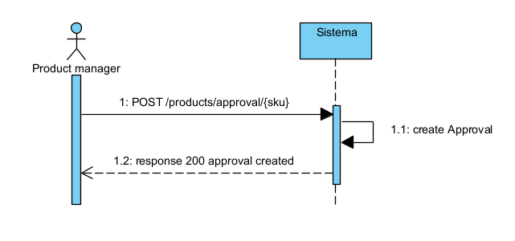

**Diagrama de sequência nivel 1 para criar aprovação de produtos**

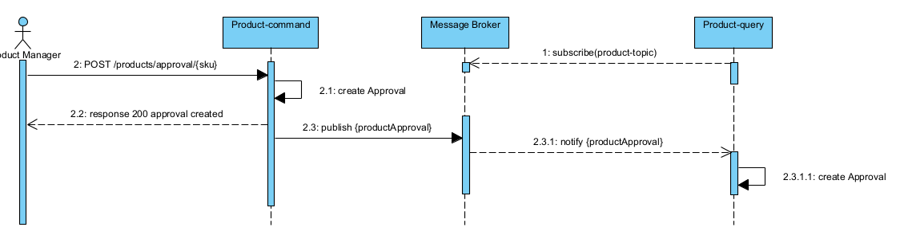

**Diagrama de sequência nivel 2 para criar aprovação de produtos**

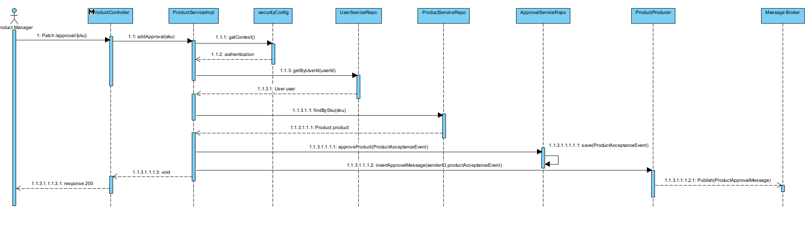

**Diagrama de sequência nivel 3 para criar aprovação de produtos**

### Publicar uma review

Na solução temos de permitir a um reviewer publicar a sua review apenas se a mesma for aceite por 2 utilizadores que a
tenham recebido como uma recomendação. Logo, a review se tiver pelo menos duas aprovações, o reviewer pode então
publicar a mesma.

Para compreender a reordenação solicitada, as descrições técnicas dos processos de publicação da revisão, de acordo
com os diagramas de sequência UML e a sua sequência correcta, são as seguintes:

Nível 1: Condição de aceitação da revisão

O processo inicia-se com a publicação de uma revisão por um revisor através do endpoint `/get/{userId}/{reviewId}`. 
O sistema verifica se a avaliação foi aceite por pelo menos dois utilizadores que a receberam como recomendação. 
Apenas se esta condição for satisfeita, é accionada a opção `createPublish`. O sistema confirma a publicação da 
revisão com base no consenso dos utilizadores, respondendo com um `200 OK` e fornecendo o `ReviewDTO` 
da revisão publicada.

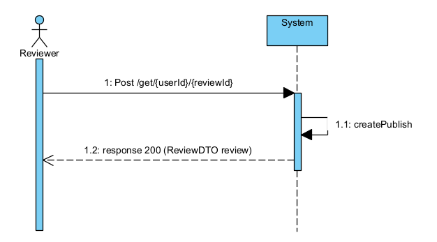

**Nível 2: Simplificação do processo de publicação da revisão**:
Isso é feito depois que o avaliador envia uma avaliação com uma solicitação POST para o `RecommendationController`
usando o mesmo endpoint. O `RecommendationController` aceita a avaliação utilizando `acceptReview` e a publica com 
`publish(Review)`. O `MessageBroker` atua como um intermediário, assinando o tópico da revisão e enfileirando a
revisão com `Queue(review)`. Por fim, o serviço `Review-query` executa o `createReview`, consolidando o processo
de publicação num fluxo mais ágil e eficiente.

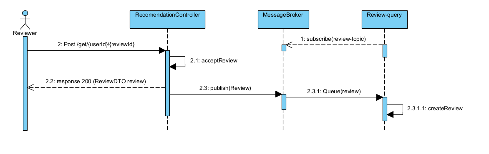

**Nível 3: Processo de publicação de revisões em várias etapas**:
Durante a fase mais complexa, o `RecommendationController` inicia o processo ao receber a solicitação do revisor.
O `ReviewServiceImpl` é então chamado para obter recomendações específicas do utilizador e localizar a revisão relevante.
O sistema efectua verificações detalhadas através de um conjunto de operações como `findByID`, `Optional<Review>`
e `findByReviewIdAndUserId`. O `ReviewServiceImpl` solicita ao `ReviewRecommendationService` a pesquisa e votação
para publicação. O `ReviewRepository` e o `PublishRepository` são consultados para guardar e atualizar o estado da
revisão. Quando todas as aprovações e votações necessárias estiverem concluídas, a revisão é guardada e publicada
utilizando `save(PublishVote vote)`.

Este procedimento técnico explica um sistema de publicação de revisões estratificado. O sistema tem três níveis, com 
complexidade crescente e abrangência de operações do nível 1 ao nível 3. Cada nível inclui camadas adicionais de
verificação e aprovação para garantir que as revisões publicadas atendam aos critérios do sistema e sejam endossadas
pela comunidade.

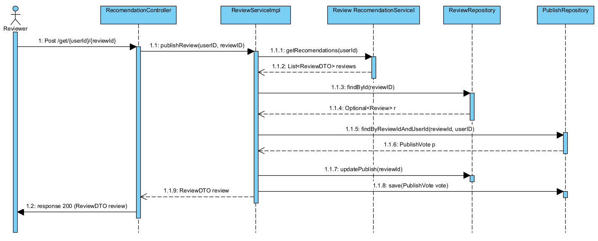

### Publicar uma review juntamente com um voto

Um utilizador que possa votar, deve conseguir ao criar o seu voto, criar tanto o voto como a review no mesmo processo.

#### Overview

Para atender ao requisito de permitir que um utilizador crie uma review e vote e no mesmo processo, implementamos a pattern Saga de microserviços. Um endpoint REST específico foi desenvolvido para processar esse tipo de operações no Reviews Command Microservice.


A forma como foi implementada foi por coreografia, onde os participantes neste caso os microserviços de reviews e votos, trocam eventos sem um ponto centralizado de controlo. Com a coreografia, cada transação local publica eventos de domínio que desencadeiam transações locais em outros serviços. Como podemos ver neste diagrama de estados, para a implementação do SAGA existe para cada iteração sempre uma transação e uma transação de compensação, isto é, se por alguma razão falhar num dos serviços ser possivel reverter o processo. Nunca em situação alguma deve ser possivel criar uma review e depois falhar no voto. Senão conseguir ser realizado o voto a review anteriormente criata deve ser apagada. Este tipo de transações de compensação deve ser executado em cadeia.

As vantagens de usar a SAGA com esta paterna por careografia de eventos significa que é totalmente escalável em que tudo é executado em forma assincrona sem introduzir um único ponto de falha, uma vez que as responsabilidades estão distribuídas entre os participantes da saga.
#### Events

| Events         | Review Microservice | Vote Microservice | Description                                                                                                     |
|----------------|---------------------|-------------------|-----------------------------------------------------------------------------------------------------------------|
| ReviewCreated  | Producer            | Consumer          | Quando uma review é criado é notificado os serviços de votos (Normal Transaction)                               |
| RollbackReview | Consumer            | Producer          | Quando existe um erro nos serviços de votos é mandado um evento de rollback nas reviews (Compensation Transaction) |


#### Implementação 

O fluxo começa muito antes de ser feito o pedido sendo que começa quando Para este requesito é então criado uma Review com um vote já associado. A criação primeiro passa pelo API Gateway que vai direcionar para o microserviço que pode fazer este tipo de operações.
Depois de feita o rederecionamento o serviço de reviews vai executar o seu procedimento de criar uma review normal. Depois de acabar é então enviado um evento para o RabbitMQ em que vai passar agora para o serviços dos votes.


O que é importante reparar nesta sequência é quando a mensagem chega ao serviço dos votes, existe então dois caminhos. Onde é criado a review e adicionado o respetivo voto na review e acaba o processo com o envia do evento de "voted-added". Caso ocorrer um erro é então publicado um evento para fazer rollback no serviço de reviews. 
Neste caso, o serviço de reviews vai apagar a review anteriormente cancelada para existir uma coerência de dados. 

Desta forma é possivel executar um processo em que engloba vários microserviços distribuidos de uma forma totalmente escalável orientada a eventos. 

#### Alternativas

A implementação alternativa adotaria a orquestração como método, em que um controlador centralizado coordena as sagas, indicando aos participantes locais quais transações executar. O orquestrador de saga gerencia todas as transações, instruindo os participantes sobre as operações a serem realizadas com base nos eventos. O orquestrador executa solicitações de saga, armazena e interpreta os estados de cada tarefa e lida com a recuperação de falhas por meio de transações compensatórias.


##### Vantagens:

- Adequado para fluxos de trabalho complexos que envolvem muitos participantes, o que não é o nosso caso. 
- Mais facil para executar testes de integração.
- Deixa de ser orientado a eventos, os participantes da saga não precisam conhecer os comandos dos outros participantes, proporcionando uma clara separação de responsabilidades que simplifica a lógica de negócios.

##### Desvantagens:

- Complexidade adicional no design requer a implementação de uma lógica de coordenação.
- Existência de um ponto de falha, pois o orquestrador pode falhar e é o responsável por gerenciar o fluxo de trabalho completo.

### Maior performance quando a demanda é maior

Como se trata de um microserviço é especialmente necessário garantir que o serviço escale como um todo para lidar com o
aumento de utilizadores e manter ou melhorar a sua performance.

### Sem mudanças na API

A api deve de ser capaz de se manter sempre igual, especialmente em relação à porta por onde é acedida, para isso foi
utilizado um reverse proxy, neste caso o nginx, que permite que a api seja acedida sempre pela mesma porta.

### SOA Strategy

O microserviço deve de estar disponivel para ser utilizado por outros microserviços e por utilizadores ou clientes
externos.

## Arquitetura Implementada

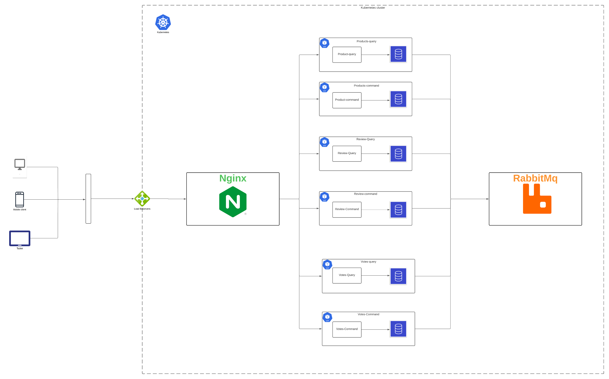

Na imagem seguinte podemos observar a solução implementada, onde cada microserviço tem uma responsabilidade única, e
a sua própria base de dados, no qual usamos o nginx como reverse proxy para que todos os microserviços possam ser
acessados através da mesma porta, também temos o rabbitmq que é o message broker que permite a comunicação entre os
microserviços. Para além disso, temos o kubernetes que permite a orquestração dos containers.

### Diagrama de componentes

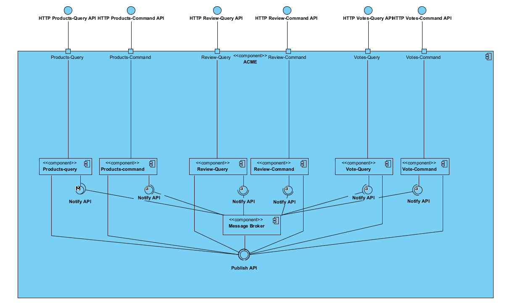

## Padrões de arquiteura orientada a microserviços e a sua implementação

### Strangler Fig

O Strangler Fig é um padrão de migração de software, que permite a migração de uma solução monolítica para uma solução
baseada em microserviços, sem que seja necessário reescrever toda a solução. Este padrão consiste em criar um novo
microserviço, que vai substituir uma parte da solução monolítica, e depois gradualmente ir substituindo as restantes
partes da solução monolítica, até que a solução monolítica seja totalmente substituída.

A solução foi dividida em 3 partes, os product, as reviews e os votes, como a solução monoítica já tinha estas 3, apenas
foi necessário utilizar o que já estava no projeto e fazer algumas alterações para que se pudesse desenvolver as
funcionalidades pedidas.

### Database per Service

Database per service, consiste em cada microserviço ter a sua própria base de dados, isto permite que cada microserviço
tenha uma base de dados que seja mais adequada para a sua funcionalidade, por exemplo, o microserviço de recomendações
pode ter uma base de dados de grafos, enquanto que o microserviço de votos pode ter uma base de dados relacional.

### Polyglot Persistence

Polyglot Persistence, consiste em diferentes microserviços terem diferentes bases de dados, no caso da nossa solução
foi utilizado o neo4j e o mongodb, em diferentes microserviços, para além disso é possível trocar a base de dados
pretendida em cada microserviço, através de variáveis de ambiente.

### Messaging

Messaging, consiste em utilizar um message broker, para que os microserviços possam comunicar entre si, sem que seja
necessário que um microserviço conheça o outro, ou seja, os microserviços apenas comunicam com o message broker, e o
message broker envia a mensagem para o microserviço pretendido. Nesta solução foi utilizado o rabbitmq como
message broker, visto ser um dos serviços mais utilizados para este fim e com um grande suporte para diferentes
linguagens de programação.

### Event Sourcing ou Domain Event

O Event Sourcing, consiste em guardar todos os eventos que acontecem na aplicação, e depois quando necessário,
reconstruir o estado da aplicação, através dos eventos guardados. Nesta solução foi utilizado o event sourcing para
guardar os utilizadores que aceitaram a recomdenção que lhes foi dada e para guardar eventos de aceitação de produtos
por parte de product managers.

### Command Query Responsibility Segregation (CQRS)

O CQRS, consiste em separar as operações de leitura e escrita criando sempre 2 tipos de microserviços para cada domain
, nomeadamente, um microserviço do tipo query e um microserviço do tipo command. O microserviço do tipo query é
responsável por fazer as operações de leitura, enquanto que o microserviço do tipo command é responsável por fazer as
operações de escrita. Assim podemos garantir um isolamento da responsabilidade de cada microserviço, tornando-os mais
eficientes e escaláveis.

### Saga

O padrão Saga, consiste em criar uma sequência de passos, que são executados de forma assíncrona, e que podem ser
revertidos caso algum passo falhe. Em principio, os microseviços seguem por norma este padrão, visto serem sistemas
distribuidos e assíncronos. Ao seguirmos o saga pattern, impedimos de que certos problemas aconteçam, como por exemplo,
não permitir que um microserviço ao fazer um insert, não consiga fazer outro insert em si mesmo mais uma vez, visto que
a mensagem é enviada para o message borker e depois é consumida pelo mesmo microserviço, pois está subscrito ao mesmo
tópico.

## Technologias utilizadas e a sua implementação

#### Neo4j

O neo4j é uma base de dados de grafos, que permite guardar dados de forma a que seja possível fazer queries de forma
mais eficiente, visto que os dados estão relacionados entre si. Nesta solução foi utilizado no microserviço dos votos e
dos produtos.

#### H2

O h2 é uma base de dados relacional, que permite guardar dados de forma a que seja possível fazer queries de forma
mais eficiente, visto que os dados estão relacionados entre si. Esta base de dados é utilizada por todos os
microserviços, especialmente pela sua facilidade de utilização e configuração.

#### Spring boot web

O spring boot web, é uma framework que permite criar aplicações web, de forma mais simples e rápida, visto que já
contém muitas funcionalidades implementadas, como por exemplo, a criação de endpoints, a criação de controllers, a
criação de serviços, a criação de repositórios, entre outros.

#### Spring boot cloud

O spring boot cloud, é uma framework que permite criar aplicações cloud, de forma mais simples e rápida, visto que já
contém muitas funcionalidades implementadas, como por exemplo, a criação de microserviços, a criação de serviços
discovery, a criação de configurações, entre outros.

#### Nginx

O nginx é um servidor que pode ter diferentes funções como por exemplo, ser um reverse proxy, ser um load balancer, API Gateway
entre outros. Nesta solução foi utilizado como reverse proxy, para que todos os microserviços possam ser acedidos
através da mesma porta, de forma a cumprir com um dos requisitos que é não mudar a porta de acesso à api.

#### Docker

O docker é uma plataforma que permite criar e executar containers, de forma a que seja possível ter uma aplicação
isolada, com todas as suas dependências, e que possa ser executada em qualquer sistema operativo. Para a nossa solução
precisamos do docker para cumprir com um dos requitos do projeto, mais especificamente, o requisito de fazer ci/cd. O de
ci/cd está relacionado com o de escalar automaticamente os microserviços, isto porque, para cada microserviço, é preciso
criar docker images e publica-las no docker hub, para que depois o kubernetes possa fazer a orchestation dos containers.

#### RabbitMQ

O rabbitmq é um message broker, que permite a comunicação entre microserviços, de forma a que seja possível enviar
mensagens de um microserviço para outro, sem que seja necessário que um microserviço conheça o outro, ou seja, os
microserviços apenas comunicam com o message broker, e o message broker envia a mensagem para o microserviço pretendido.

#### Kubernetes

O kubernetes é uma plataforma que permite fazer a orchestation de containers, de forma a que seja possível escalar
automaticamente os microserviços, de acordo com a demanda, isto é, se a demanda for maior, o kubernetes cria mais
containers, e se a demanda for menor, o kubernetes elimina containers, de forma a que seja possível poupar recursos.
O kubernetes é constituido por um cluster, que é composto por um master node e por worker nodes, o master node é
responsável por gerir os worker nodes, e os worker nodes são responsáveis por executar os containers. Estes nodes são
chamados de pods, e cada pod pode ter um ou mais containers. Para além disso, num cluster, existem os services, que
permitem que os pods possam comunicar entre si, e os deployments, que permitem que os pods possam ser escalados. Nos
deployments é onde são definidas as regras de escalabilidade, como por exemplo, o número de replicas que um pod pode
ter.

Para a nossa solução criamos yaml files para cada microserviço e para cada HPA (Horizontal Pod Autoscaler), que
permitem que os pods possam ser escalados, de acordo com a demanda. Aqui entram as docker images publicadas no docker
hub, que são utilizadas para criar os pods.

## Como executar a solução

A execução da solução é feita através da cli que o kubernetes disponibiliza, o kubectl. Para executar a solução é
preciso instalar o kubernetes e o minikube, que é uma ferramenta que permite criar um cluster kubernetes localmente.
Para que se possa executar a solução, é preciso executar os seguintes comandos:

```bash
minikube start
kubectl apply -f .
```

Para se obter mais informação pode se executar o comando `minikube dashboard`, que abre o dashboard do kubernetes, onde
é possível ver todos os pods, services, deployments, entre outros. Ou se preferir pode se executar o comando.

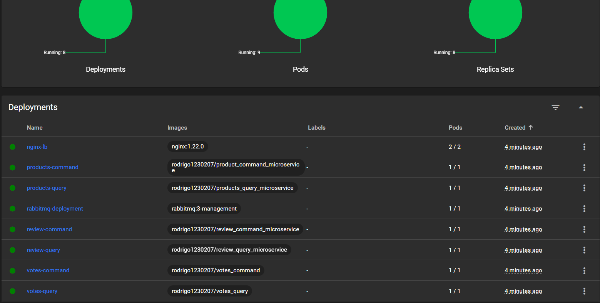

```bash
kubectl get all
```

Este comando permite ver todos os pods, services, deployments que estão a correr a través da command line.

## Extras

Era do interesse da equipa implementar mais microserviços em diferentes linguagens de programação para mostrar o
verdadeiro uso dos microçerviços, que é fazer um sistma isolado e que permita que independentemente da technologia que
seja utilizada, os microserviços possam comunicar entre si. No entanto, devido ao tempo limitado, não foi possível
implementar mais microserviços. Contudo, ainda se chegou a fazer alguns prototipos, em rust, go e c#, que não foram
implementados na solução final, porque havia coisas mais importantes para desenvolver no projeto. Por isso, apenas se
vai referir aqui o que seria utilizado para implementar nestas 3 linguagens de programaçãos os microserviços.

### Rust

O Rust é uma linguagem de programação especializada para sistemas de baixo nível, que permite fazer aplicações
eficientes e seguras devido aos seus diversos sistemas como, o borrow checker e o ownership. A escolha do rust para
implementar um microserviço deve-se ao facto de ser uma linguagem de programação que tem um grande ecosistema e que tem
bom suporte para o rabbitmq e frameworks para criar aplicações web com uma performance exurbitante. Para este protótipo
foi utilizado o acticx web, que é um framework para criar aplicações web em rust, o diesel, que é um ORM para rust, com
o objetivo de implementar uma com uma base de dados em postgresql.

### Go

O Go é uma linguagem de programação que permite criar aplicações de forma rápida e eficiente, foi criado pela google e
tem um grande ecosistema. A escolha do go para implementar um microserviço deve-se ao facto de ser uma linguagem de
programação simples e que é especialmente bom para sistemas concorrentes. Para este protótipo foi utilizado o gin, que
é um framework para criar aplicações web em go, o gorm, que é um ORM para go.

### C#

O C# é uma linguagem de programação que permite criar aplicações de forma rápida e eficiente, foi criado pela microsoft.
A escolha do C# para implementar um microserviço deve-se ao facto de ser uma linguagem de programação simples e parecida
ao java. Para este protótipo foi utilizado o asp.net core, que é um framework para criar aplicações web em C#, o entity
framework core, que é um ORM para C#.

## Performance

Para testar a performance da solução, foi utilizado o JMeter, onde foi possível testar a performance da solução
monolítica e da solução baseada em microserviços.

### Primeira Solução

#### Load Test

O pie chart mostra que, durante o teste de carga, houve uma elevada taxa de falha de 61,7% na
conclusão dos pedidos, o que indica problemas críticos de fiabilidade. De um total de 78 984 pedidos, 
48 730 falharam, resultando numa elevada percentagem de erro. O tempo médio de resposta foi de 1108,46
milissegundos, o que ultrapassa o limite desejado, com alguns casos extremos a atingirem 766,20 segundos.
Os tempos de resposta, incluindo a mediana e o percentil 90 de 1698,00 e 2514,00 milissegundos, 
respetivamente, sugerem possíveis problemas de desempenho. O throughput do sistema foi medido em 262,16
transacções por segundo.

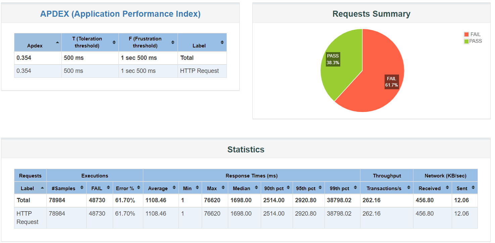

#### Stress Test

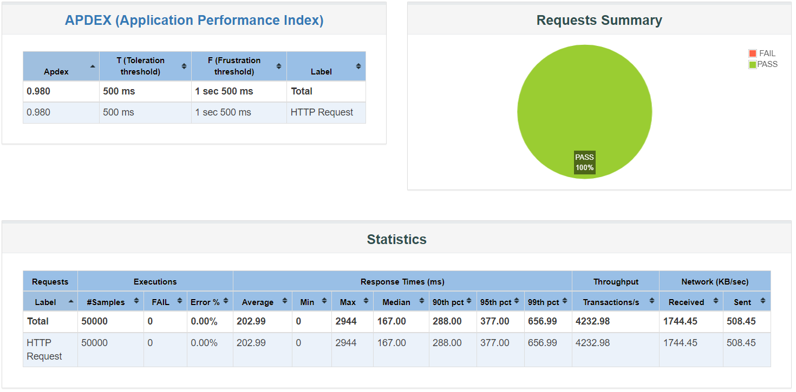

O sistema tratou sem falhas todos os 50.000 pedidos durante o teste, atingindo uma taxa de aprovação de 100%.
O seu tempo médio de resposta de 202,99 milissegundos ultrapassou confortavelmente os limites definidos.
A maioria das respostas foi rápida, com um tempo médio de 167,00 milissegundos, e mesmo o percentil 99
registou um tempo de resposta rápido de 656,99 milissegundos.

O sistema demonstrou a sua robustez com um elevado throughput de 4232,98 transacções por segundo e uma
atividade de rede substancial, indicando a sua eficiência na gestão de uma carga significativa.

#### Soak Test

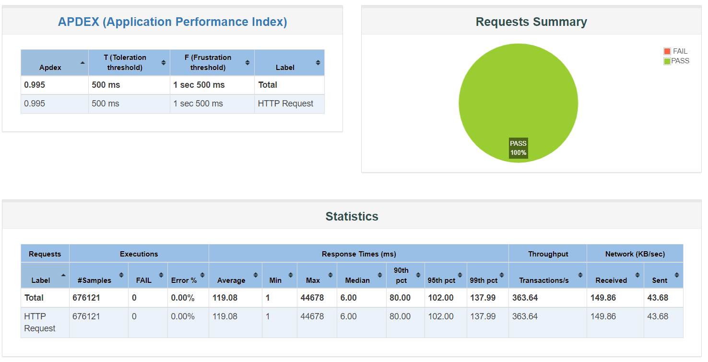

O sistema mostra uma taxa de sucesso perfeita, com todas as 676.121 solicitações aprovadas,
indicando um sistema excecionalmente estável.

Na secção Estatísticas, o tempo médio de resposta é de 119,08 milissegundos, e a mediana é ainda mais rápida,
com 6 milissegundos, demonstrando um tratamento consistente e rápido dos pedidos. Os tempos de resposta
para os percentis 90 e 95 permanecem baixos, com 80 e 102,02 milissegundos, respetivamente. Isto mostra
que o sistema mantém o seu desempenho mesmo quando se aproxima dos limites superiores de carga. e a taxa
de transferência é impressionante, com 363,64 transacções por segundo.

### Segunda Solução

#### Load Test

O pie chart mostra que, durante o teste de carga, houve uma elevada taxa de falha de 76,72% na conclusão dos pedidos, o
que indica problemas críticos de fiabilidade. De um total de 605762 pedidos, 464762 falharam, resultando numa elevada
percentagem de erro. O tempo médio de resposta foi de 82,07 milissegundos, com alguns casos a atingirem um tempo de
resposta de 2443 ms. O throughput do sistema foi medido em 2020,22 transacções por segundo. Através dos dados e
comparando à solução monolítica, podemos concluir que a solução baseada em microserviços é muito mais eficiente e isso é
possivel ver pelos números, contudo a taxa de error é muito elevada, apesar de que o erro ser devido não a performance
em si, mas possivelmente das configurações do kubernetes.

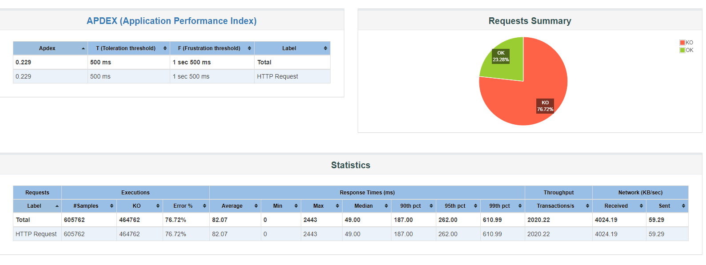

#### Stress Test

O sistema tratou sem falhas todos os 50.000 pedidos durante o teste, atingindo uma taxa de aprovação de 100%.
O seu tempo médio de resposta de 289,46 milissegundos ficou aquém do esperado que era pelo menos ter uma performance
melhor comparativamente à solução monolitica. Para almém disso, teve um throughput de 3235.20 transacções por segundo, o
que também fica à quem do esperado visto que a solução monolitica teve um throughput de 4232,98 transacções por segundo.

Infelizmente a solução baseada em microserviços não teve uma performance melhor que a solução monolitica no stress test.

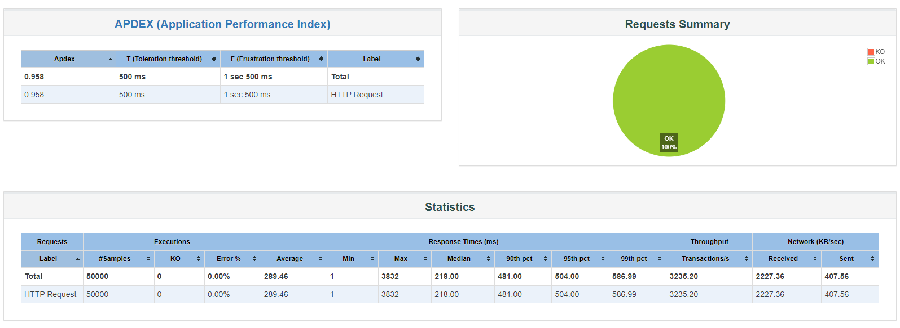

#### Soak Test

O sistema mostra uma taxa de sucesso muito baixa, na qual, de 3985145 pedidos, 3110139 falharam, resultando numa taxa de
sucesso de 21,96%. O tempo médio de resposta é de 21,78 milissegundos, e a mediana é ainda mais rápida,
com 5 milissegundos, demonstrando um tratamento consistente e rápido dos pedidos. Por fim a taxa
de transferência é de 2143.35 transacções por segundo, demonstrando assim uma alta performance.

Pelos seguintes dados, podemos concluir que a solução baseada em microserviços tem uma performance muito melhor que a
solução monolitica, no entanto, a taxa de sucesso é muito baixa, isto pode ser devido a configurações do kubernetes como
foi referido anteriormente,


## CI/CD
O Jenkins funciona como o servidor de automação para Integração Contínua e Implantação Contínua (CI/CD). 
Nosso processo simplificado compila microsserviços em arquivos JAR executáveis, constrói imagens Docker 
correspondentes e as publica no Docker Hub. Isso garante que as iterações mais recentes de nossos microsserviços
estejam prontamente disponíveis para distribuição e implantação. O Jenkins é uma ferramenta essencial para aprimorar
nossas operações de desenvolvimento e processos de entrega.
A pipeline automatiza o processo de criação e implantação de microsserviços, permitindo atualizações e lançamentos contínuos.

```groovy
pipeline {
    agent any

    environment {
        // Define DockerHub credentials
        DOCKERHUB_CREDENTIALS = credentials('dockerhub-rodrigo1230207')
        REPOSITORY = 'rodrigo1230207' // Replace with your actual repository

    }

    stages {
        stage('Build') {
            steps {
                script {
                    // List of microservice directories
                    def services = [
                        'Product_command_microservice',
                        'Products_query_microservice',
                        'Review_command_microservice',
                        'Review_query_microservice',
                        'votes_command',
                        'votes_query'
                    ]

                    // Iterate over each service and build with Maven
                    for (service in services) {
                        bat """
                        cd Microservices/${service}
                        mvn clean package -DskipTests
                        cd ..
                        """
                    }
                }
            }
        }


        stage('Build and Push Images') {
            steps {
                script {
                    // Assuming you have a list of directories for microservices
                    def services = [
                        'Product_command_microservice',
                        'Products_query_microservice',
                        'Review_command_microservice',
                        'Review_query_microservice',
                        'votes_command',
                        'votes_query'
                    ]

                    // Login to DockerHub
                    bat 'echo %DOCKERHUB_CREDENTIALS_PSW% | docker login -u %DOCKERHUB_CREDENTIALS_USR% -p %DOCKERHUB_CREDENTIALS_PSW%'

                    // Iterate over each service, build and push
                    for (service in services) {

                        def image = "${REPOSITORY}/${service.toLowerCase()}:latest"
                        // Build the Docker image using Windows batch command
                        bat "docker build -t ${image} ./Microservices/${service}"
                        // Push the image to Docker Hub
                        bat "docker push ${image}"
                    }
                }
            }
        }
    }
}
```

O Jenkinsfile é escalável, facilitando a adição ou modificação de serviços. Este pipeline CI/CD é essencial para apoiar um
ambiente de desenvolvimento dinâmico e iterativo.

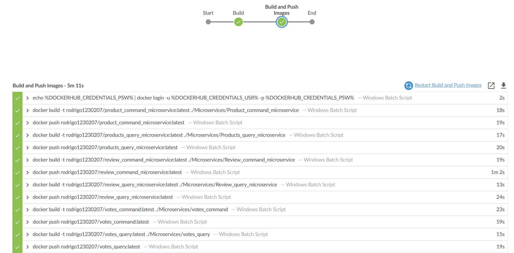

# Microservices Architecture 

## API Gateway

Um API Gateway é um servidor que funciona como a frente de uma API, recebendo pedidos de API, aplicando políticas de limitação e segurança, encaminhando pedidos para o serviço de back-end e, em seguida, reencaminhando a resposta ao solicitante.

Nestas configurações tanto utilizamos o Nginx como um proxy reverso como fazemos o routing de diferentes pedidos com base no caminho e no método do pedido. 

``` groovy
location /products {
    if ($request_method = GET) {
        proxy_pass http://products-query;
    }
    if ($request_method = POST) {
        proxy_pass http://products-command;
    }
    if ($request_method = PUT) {
        proxy_pass http://products-command;
    }
    if ($request_method = DELETE) {
        proxy_pass http://products-command;
    }
    if ($request_method = PATCH) {
        proxy_pass http://products-command;
    }
}
```

## Bootstrapping

Quando um serviço é iniciado ele precisa de ir buscar dados de forma a estar com os dados mais recentes para o seu normal funcionamento. O que implementamos é que quando o serviço é criado é feito um pedido REST para atualizar os dados.


Como vemos na figura acima, quando o VotesQueryMS é inicializado ele faz um pedido REST ao API Gateway, sendo que este próprio escolhe o microservice em que pode buscar este tipo de dados e faz o respetivo rederencionamento. Depois do pedido feito o VotesQueryMS tem consigo os dados que precisa para funcionar, sendo que neste caso são as reviews.

## Event Driven Sequence 

No diagrama abaixo está representado um fluxo normal de eventos quando uma review é encontrada e que tipo de evento é disputado e como outros microserviços consomem para o normal funcionamento. 


## Votes Service - Escolhas arquitecturais

### Problema

O desafio surge na decisão de incluir informações sobre produtos e avaliações no microsserviço de Votos ou se deve se concentrar exclusivamente em avaliações.

### Considerações

#### Incluir Produtos no Serviço de Votos

**Prós:**
- Simplifica consultas e relatórios para votos relacionados a produtos específicos.
- Evita a necessidade de consultas entre serviços para recuperar informações de produtos durante o processamento de votos.

**Contras:**
- Aumenta o acoplamento entre o serviço de Votos e o serviço de Produtos.
- Pode levar a redundâncias se os produtos já forem mantidos no serviço de Produtos.

#### Incluir Apenas Avaliações no Serviço de Votos

**Prós:**
- Simplifica o design e reduz o escopo do serviço de Votos para se concentrar exclusivamente no mecanismo de votação para avaliações.
- Desacopla o serviço de Votos de alterações no serviço de Produtos.

**Contras:**
- Requer consultas entre serviços para recuperar informações de produtos quando necessário para relatórios ou outras funcionalidades.

### Decisão

Após uma cuidadosa consideração, decidimos incluir apenas reviews no serviço de Votos. Essa decisão está alinhada com as melhores práticas de microsserviços, promovendo um acoplamento entre os serviços e permitindo que cada serviço se concentre em suas responsabilidades principais.

### Detalhes de Implementação

- O serviço de Votos gerenciará exclusivamente votos para reviews.
- Mecanismos de comunicação entre serviços serão implementados para recuperar informações de reviews quando necessário.